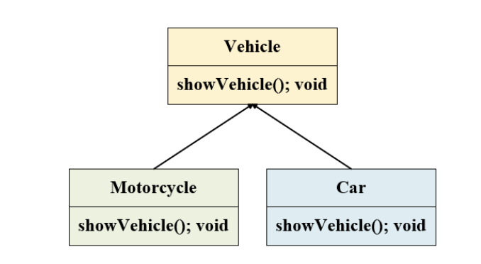

# Task 1

## 1.1 Define what is OOP, what are the advantages and disadvantages of OOP, list and discuss the four building blocks of OOP?

#### Object-Oriented Programming (OOP) is a programming paradigm that relies on the concept of classes and objects. It is used to structure a program into simple, reusable pieces of code blueprints.

**Advantages of OOP:**
- A real-world idea can be demonstrated.
- Effective problem solving.
- Code flexibility.
- Code reusability.
- Security.

**Disadvantages of OOP:**
- Large programs.
- Requires designing and programming skills.
- Slow-running programs.

**Building Blocks of OOP:**
- **Class:** A blueprint that defines the required information set in an object.
- **Objects:** Instances of classes.
- **Methods:** Functions declared within a class and used to perform certain actions.
- **Attributes:** Data stored inside a class or an object that represent different features.
## 1.2 Explain the key features (e.g, inheritance, polymorphism etc) of OOP

- **Encapsulation:**
Encapsulation is a way of restricting access to certain variables or properties. The meaning of “Encapsulation” is to make sure that “sensitive” data is hidden from users. It involves declaring class variables/attributes as private and providing public get and set methods to access and update the value of a private variable.

- **Inheritance:**
Inheritance is one of the most important features in OOP. It allows the creation of a new class that inherits the attributes and methods from an existing class, promoting code reusability. The inheritance concept is grouped into two categories: Subclass (child) - the class that inherits from another class, and Superclass (parent) - the class being inherited from.

- **Polymorphism:** 
Polymorphism allows a single action to be performed in different ways. It occurs when classes related by inheritance can use the same method in different forms, promoting code reusability.

- **Abstraction:** 
Abstraction hides certain details and shows only essential information to the user. It can be done using abstract classes or interfaces. An abstract class cannot create objects and must be inherited. An abstract method in an abstract class has no body and is implemented by the subclass. Abstraction simplifies programming by hiding unnecessary details and showing only relevant details to the user.

## 1.3 Explain the importance of encapsulation, inheritance, polymorphism, and abstraction in OOP.

**Importance of Encapsulation:**
- Control the way of data accessibility.
- Flexibility and reusability: the programmer can change one part of the code without affecting other parts.
- Increased security of data.

**Importance of Inheritance:**
- Promotes code reusability by allowing new classes to reuse attributes and methods of existing classes.
- Simplifies code maintenance and reduces redundancy.

**Importance of Polymorphism:**
- Enhances flexibility and maintainability of code.
- Allows for the implementation of elegant and simple code structures.
- Supports method overriding and overloading, enabling different behaviors for the same method.

**Importance of Abstraction:**
- Simplifies complex systems by breaking them down into smaller, manageable parts.
- Enhances code readability and reduces complexity.
- Focuses on essential features, ignoring irrelevant details.
## 1.4 Write a statement/code example for each key feature of OOP in python language.

```python
# Encapsulation
class HumanBeing:
    def __init__(self):
        self.__height = 0 
        self.__weight = 0 
        self.__BMI = 0 

    def get_height(self):
        return self.__height

    def set_height(self, height):
        self.__height = height

    def get_weight(self):
        return self.__weight

    def set_weight(self, weight):
        self.__weight = weight

    def get_BMI(self):
        return self.__BMI
```

```python
# Inheritance
class Vehicle:
    def __init__(self, fuel_amount, capacity):
        self.fuel_amount = fuel_amount
        self.capacity = capacity

    def apply_brake(self):
        print("Brake applied")

class Bus(Vehicle):
    def __init__(self, fuel_amount, capacity):
        super().__init__(fuel_amount, capacity)

    def apply_brake(self):
        print("Bus brake applied")

class Car(Vehicle):
    def __init__(self, fuel_amount, capacity):
        super().__init__(fuel_amount, capacity)

    def apply_brake(self):
        print("Car brake applied")

class Truck(Vehicle):
    def __init__(self, fuel_amount, capacity):
        super().__init__(fuel_amount, capacity)

    def apply_brake(self):
        print("Truck brake applied")
```

```python
# Polymorphism
class Animal:
    def sound(self):
        pass

class Dog(Animal):
    def sound(self):
        return "Bow Bow"

class Cat(Animal):
    def sound(self):
        return "Meow Meow"

class Duck(Animal):
    def sound(self):
        return "Quack Quack"

def make_sound(animal):
    print(animal.sound())
```

```python
# Abstraction
from abc import ABC, abstractmethod

class Animal(ABC):
    @abstractmethod
    def sound(self):
        pass

class Dog(Animal):
    def sound(self):
        return "Bow Bow"
```

# Task 2
#### In this task, you are required to write an OOP code in Python language that covers the key features of OOP in real-life scenarios, the key features include the following concepts:
- Encapsulation
- Inheritance
- Polymorphism
- Abstraction

## 2.1 Create a class called Car. The class should have two fields: car_doors and car_year. Create a constructor for defining two integers, create a showcar() method that prints out no_of_doors and car_year_manufactured. Create three objects, Ford, Toyota, Honda for this class.

```python
# class Car with two fields car_doors and car_year
class Car: 
            def __init__(self, car_door, car_year):
                self.car_door = car_door
                self.car_year = car_year
# method showcar() that prints out no_of_doors and car_year_manufactured
            def showcar(self):
                print(f'no_of_doors: {self.car_door} car_year_manufactured: {self.car_year}')
            
# Three objects, Ford, Toyota, Honda for this class.
Ford = Car(4, 2020)
Toyota = Car(4, 2019)
Honda = Car(2, 2018)

# Testing
Ford.showcar()
Toyota.showcar()
Honda.showcar()

# Output:
# no_of_doors: 4 car_year_manufactured: 2020
# no_of_doors: 4 car_year_manufactured: 2019
# no_of_doors: 2 car_year_manufactured: 2018
```

## 2.2 Write a program to implement inheritance from the following UML class diagram: 

```python
# UML Diagram
class Vehicle:
    def showVehicle(self):
        pass

# Inheritance and exstend of the Vehicle class
class Car(Vehicle):
    def showVehicle(self):
        pass

class MotorCycle(Vehicle):
    def showVehicle(self):
        pass
```

## 2.3 Write a program to give the example for method overriding concepts.
```python
# Class Vehicle with a method showVehicle that is overridden by the Car and MotorCycle classes
class Vehicle:
    def showVehicle(self):
        pass

# Inheritance of the Vehicle class and Overriding the showVehicle method
class Car(Vehicle):
    def showVehicle(self, make, model, doors):
        print(f"Make: {make} Model: {model} Doors: {doors}")

class MotorCycle(Vehicle):
    def showVehicle(self, make, model, type):
        print(f"Make: {make} Model: {model} Type: {type}")

# Testing the implementation
Car().showVehicle("Honda", "Civic", 4)
MotorCycle().showVehicle("Yamaha", "YZ", "Sport")
        
# Output
# Make: Honda Model: Civic Doors: 4
# Make: Yamaha Model: YZ Type: Sport
```
## 2.4 Write a program to demonstrate static variables, methods, and blocks.

```python
class Shape:
    # static variable
    cat = 'Geometrical'

    # constructor
    def __init__(self, type):
        # instance variable
        self.type = type

    # static method to show custom message
    @staticmethod
    def info(msg):
        print(msg)
        print("This class is used for representing different shapes.")
    
    # instance method to show shape category and type
    def show(self):
        print("Shape is of category", Shape.cat)
        print("And shape is", self.type)

# Testing: calling static method
Shape.info("Welcome to Shape class")

# creating object of Shape class
Shape("Circle").show()

# output
# Welcome to Shape class
# This class is used for representing different shapes.
# Shape is of category Geometrical
# And shape is Circle
```